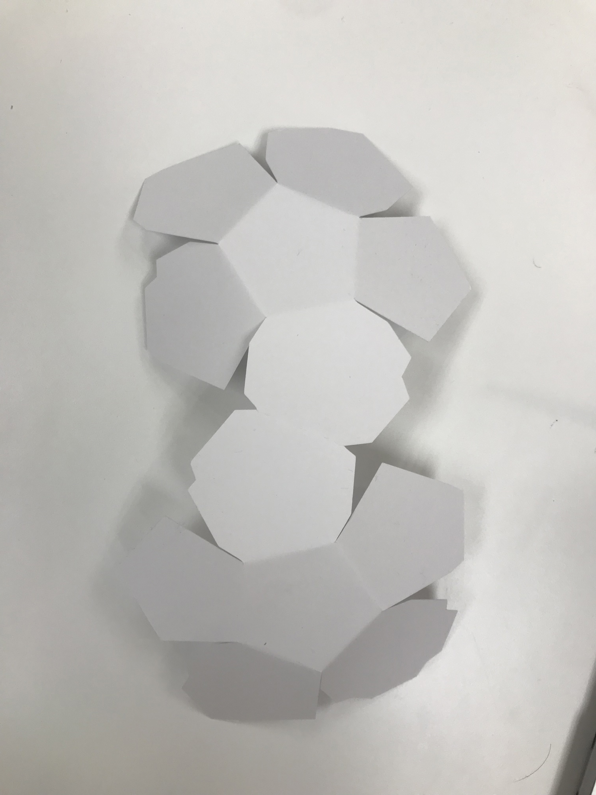
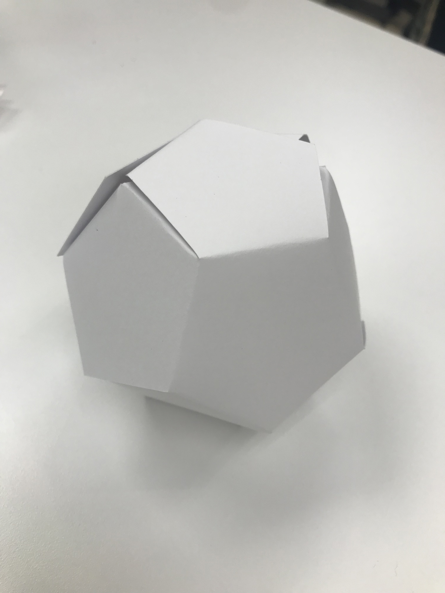
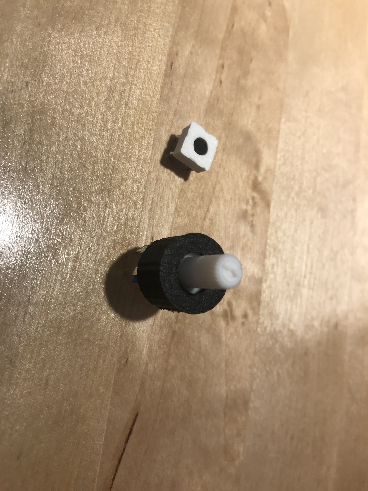
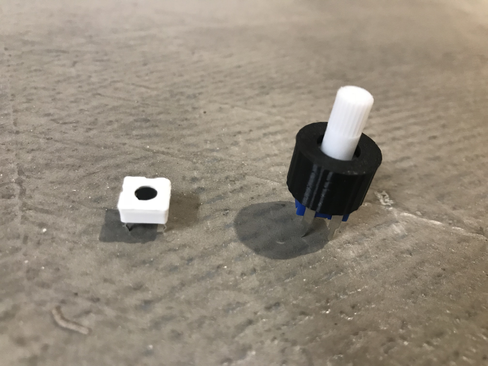

# CIM642_Physical_Computing

## Week 1
#### The Fleeting Capsule

The Fleeting Capsule is a new transportation in the future, it will send you to anywhere in a blink of an eye.

## Week 2

[Aduino project #2 - Spaceship | Video](https://vimeo.com/328067242)

## Week 3
#### One Button Interaction User Flow

## Week 4
[Aduino project #3 - Love-O-Meter | Video](https://vimeo.com/328068207)

[Aduino project #4 - Color Mixing Lamp | Video](https://vimeo.com/328069452)

## Week 5
[Aduino project #12 - Knock Lock | Video](https://vimeo.com/328070098)

## Sensor Walk
I am a music lover and I went to an musical instrument store. The DJ equipments got my attention. After chatting with the staff in store, I learned that when the DJ are producing music, the LED background light reacts to the sound. The way the LED background lights respond to music are programmed by a group of specialist before the performance. That inspired me to make an installation about music.

## Paper Prototype

## 3D Printing Parts

